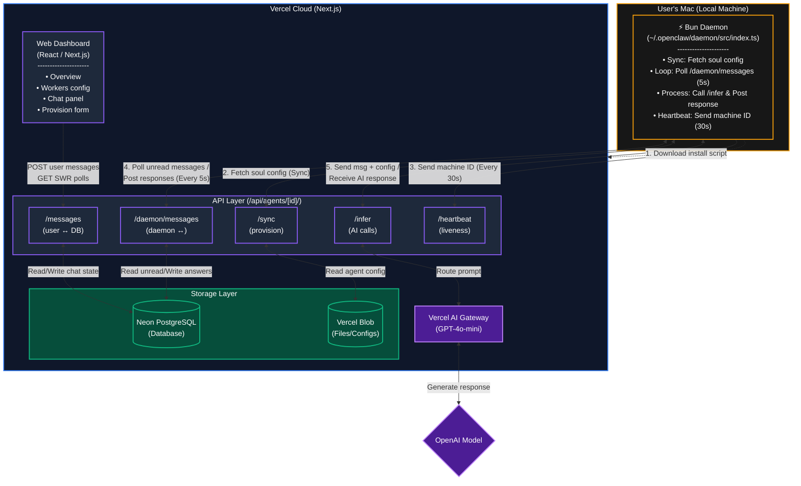

# V0-Agent — AI Worker Command Center

> A **full-stack AI agent management platform** that provisions, monitors, and orchestrates autonomous AI workers running locally on user machines. Each agent runs as an isolated daemon on the user's Mac, receives instructions from a cloud dashboard, and executes AI-powered tasks with streaming responses.

---

## Table of Contents

- [Tech Stack](#tech-stack)
- [Project Structure](#project-structure)
- [High-Level Architecture & Design Choices](#high-level-architecture--design-choices)
- [System Interconnectivity](#system-interconnectivity)
- [Deployment & CI/CD](#deployment--cicd)
- [Getting Started](#getting-started)
- [Development](#development)

---

## Tech Stack

| Layer | Technology |
|---|---|
| **Frontend** | React 19, Next.js 16 (App Router), Tailwind CSS 4, shadcn/ui |
| **Backend / API** | Next.js API Routes, Neon PostgreSQL, Vercel Blob |
| **AI / LLM** | Vercel AI SDK 6, AI Gateway (OpenAI GPT-4o-mini) |
| **Agent Runtime** | Bun (TypeScript runtime), Vercel Workflows |
| **State Management** | SWR (client-side caching & sync) |
| **Database** | Neon PostgreSQL (serverless) |
| **File Storage** | Vercel Blob (agent configs, SOUL files) |
| **Deployment** | Vercel (Cloud Functions), GitHub Actions |

---

## Project Structure

```
v0-agent/
├── app/
│   ├── api/
│   │   ├── agents/
│   │   │   ├── [id]/
│   │   │   │   ├── messages/route.ts          # Message polling (user-facing)
│   │   │   │   ├── daemon/messages/route.ts   # Message delivery (daemon-facing, no auth)
│   │   │   │   ├── infer/route.ts             # Server-side AI inference
│   │   │   │   ├── sync/route.ts              # Daemon sync & config delivery
│   │   │   │   ├── heartbeat/route.ts         # Liveness check (machine ID tracking)
│   │   │   │   └── route.ts                   # Agent CRUD
│   │   │   └── route.ts                       # List agents, create agent
│   │   └── auth/
│   │       └── [...]                          # Auth endpoints (login, register, session)
│   ├── install.sh/
│   │   └── route.ts                           # Install script (Bun daemon provisioning)
│   ├── workers/
│   │   └── page.tsx                           # Workers dashboard (agent config view)
│   └── page.tsx                               # Overview dashboard
├── components/
│   ├── agent-card.tsx                         # Agent status card with install prompt
│   ├── chat-side-over.tsx                     # Chat panel (send messages to agent)
│   ├── provision-form.tsx                     # Provision new agent form
│   ├── worker-grid.tsx                        # Grid of active agents
│   ├── sidebar.tsx                            # Main navigation
│   └── workers-list.tsx                       # Workers config details
├── lib/
│   ├── db.ts                                  # Database queries & types
│   ├── auth.ts                                # Session & auth helpers
│   └── provision-types.ts                     # Workflow & provisioning types
├── workflows/
│   └── openclaw-provision.ts                  # Vercel Workflow (agent onboarding)
├── public/
│   └── [assets]
├── styles/
│   └── globals.css                            # Tailwind + design tokens
├── package.json
├── tsconfig.json
├── next.config.js
├── tailwind.config.js
└── vercel.json
```

---

## High-Level Architecture & Design Choices

### Local Daemon Model

V0-Agent uses a **decentralized agent execution model** where each AI worker runs as an isolated daemon on the user's local machine (currently macOS). This approach provides:

- **Data Sovereignty:** User keeps control over agent execution and local data.
- **Low Latency:** No round-trip API calls for each task; inference happens locally.
- **Horizontal Scalability:** Each machine can run multiple agent daemons in parallel.
- **Resilience:** Daemons survive dashboard restarts; cloud only coordinates, not executes.

### Provisioning Flow

1. **Dashboard Creation:** User defines agent in cloud dashboard with soul configuration (instructions).
2. **Workflow Dispatch:** Vercel Workflow (`openclaw-provision.ts`) generates agent credentials and deployment script.
3. **Install Command:** Dashboard displays one-line curl script embedding agent ID.
4. **Daemon Startup:** User runs curl on local Mac; Bun runtime installs, fetches daemon code, launches background process.
5. **Sync & Heartbeat:** Daemon syncs soul config, then sends heartbeats every 30s to cloud (dashboard updates online status).

### Message Polling & AI Inference

- **Pull, not Push:** Daemon polls `/api/agents/[id]/daemon/messages` every 5 seconds for unread user messages.
- **Server-Side Inference:** Daemon calls `/api/agents/[id]/infer` with user message + soul config; server runs AI via Vercel AI Gateway (GPT-4o-mini).
- **Stateless Responses:** Daemon posts response back via `/daemon/messages` (no persistent session state on daemon).

### Daemon Authentication

Daemon endpoints (`/daemon/messages`, `/infer`) do **not** require user session auth; they authenticate only by `agentId` (a UUID), ensuring daemons behind NAT can call cloud APIs without OAuth.

---

## System Interconnectivity



### Data Flow Example

1. **User sends message in dashboard chat panel**
   ```
   Dashboard → POST /api/agents/[id]/messages → DB (message stored)
   ```

2. **Daemon polls for new messages**
   ```
   Daemon → GET /api/agents/[id]/daemon/messages → Returns unread messages
   ```

3. **Daemon requests AI response**
   ```
   Daemon → POST /api/agents/[id]/infer {message, soulConfig}
   → Server calls Vercel AI Gateway
   → OpenAI GPT-4o-mini generates response
   → Returns response to daemon
   ```

4. **Daemon posts response**
   ```
   Daemon → POST /api/agents/[id]/daemon/messages {response, replyToId}
   → DB marks message as answered
   ```

5. **Dashboard receives response**
   ```
   Dashboard SWR poll → GET /api/agents/[id]/messages → Shows response
   ```

---

## Deployment & CI/CD

### GitHub Actions Pipeline

**CI** (Branch validation on PR/push):
```yaml
- Lint & typecheck (TypeScript)
- Build Next.js app
- Run tests (Jest)
```

**Production** (Push to `main`):
```yaml
- Build Next.js
- Deploy to Vercel (automatic via GitHub integration)
- Install script auto-updates (no rebuild needed; script is generated)
```

### Environment Variables Required

```env
# Database
DATABASE_URL=postgresql://...@[neon-host]:5432/[db]

# Auth
NEXTAUTH_URL=https://v0-agent-smw.vercel.app
NEXTAUTH_SECRET=[random-secret]

# Vercel AI Gateway (optional; uses zero-config by default)
AI_GATEWAY_API_KEY=[optional-if-using-non-default-providers]

# Blob Storage
BLOB_READ_WRITE_TOKEN=[vercel-blob-token]
```

---

## Getting Started

### Prerequisites

- Node.js 18+
- PostgreSQL (Neon) or local `psql`
- Vercel account (for blob storage & deployment)

### 1. Clone Repository

```bash
git clone https://github.com/sethum-VS/V0-Agent.git
cd V0-Agent
```

### 2. Install Dependencies

```bash
pnpm install
# or npm install, yarn install, bun install
```

### 3. Setup Database

```bash
# Create `.env.local`
cp .env.example .env.local

# Update DATABASE_URL with your Neon connection string
# Run migrations (if any)
npm run migrate  # or manual psql
```

### 4. Start Development Server

```bash
npm run dev
```

Navigate to [http://localhost:3000](http://localhost:3000)

### 5. Provision Your First Agent

1. Click "Provision New Worker"
2. Enter soul configuration (e.g., "You are a helpful assistant")
3. Select AI model (GPT-4o-mini)
4. Click "Generate Install Command"
5. Copy the curl command (embeds agent ID)
6. On your Mac terminal, run the curl command
7. Watch the dashboard update to "System Online" once daemon connects

---

## Development

### Local Development Flow

```bash
# Terminal 1: Next.js dev server
npm run dev

# Terminal 2: Optional — inspect daemon logs
tail -f ~/.openclaw/daemon.log
```

### Key Files for Common Tasks

| Task | File |
|---|---|
| Add new API endpoint | `app/api/[path]/route.ts` |
| Modify dashboard UI | `components/` or `app/[page]/page.tsx` |
| Update agent provisioning | `workflows/openclaw-provision.ts` |
| Daemon logic (message polling, AI calls) | `app/install.sh/route.ts` (inline daemon code) |
| Database schema | `lib/db.ts` |

### Testing

```bash
npm run test
```

### Building for Production

```bash
npm run build
npm start
```

---

## Troubleshooting

**Agent shows "Awaiting Link" but daemon is running:**
- Check logs: `tail ~/.openclaw/daemon.log`
- Verify daemon can reach cloud: `curl https://v0-agent-smw.vercel.app/api/agents/[id]/heartbeat`

**Messages not being delivered:**
- Daemon only polls every 5 seconds; wait a moment
- Check daemon logs for inference errors
- Verify AI_GATEWAY_API_KEY is set (if using custom provider)

**Deployment Protection 401 error:**
- Go to Vercel Dashboard → Project Settings → Deployment Protection
- Set to "None" or "Only Production" so install script can access `/install.sh`

---

## License

MIT

---

**Maintained by:** sethum-VS  
**Last Updated:** May 2026
